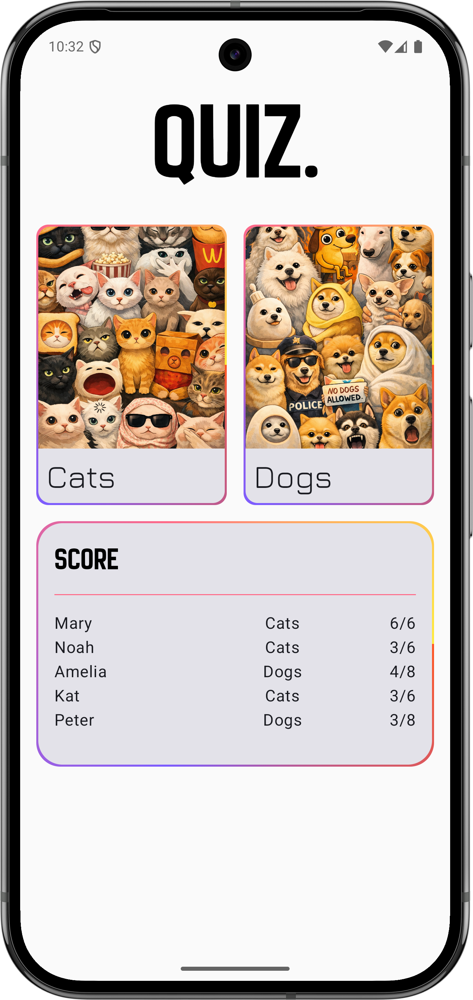
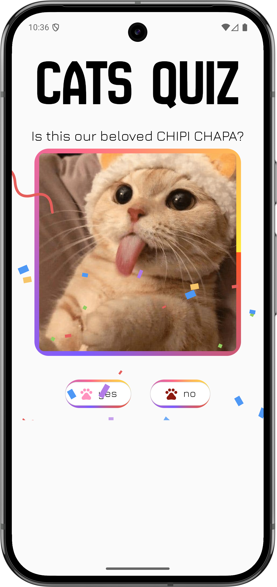
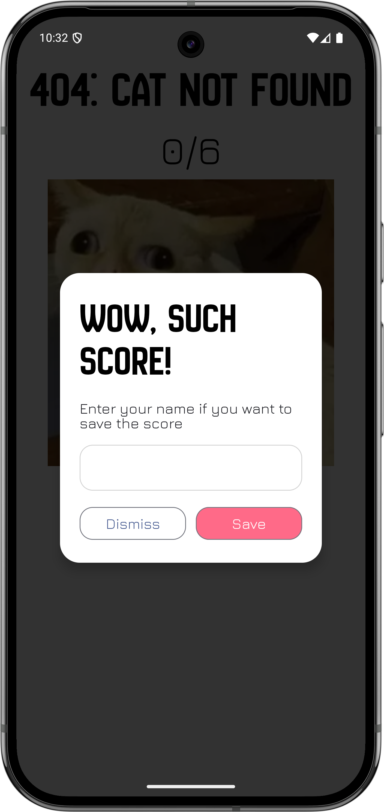
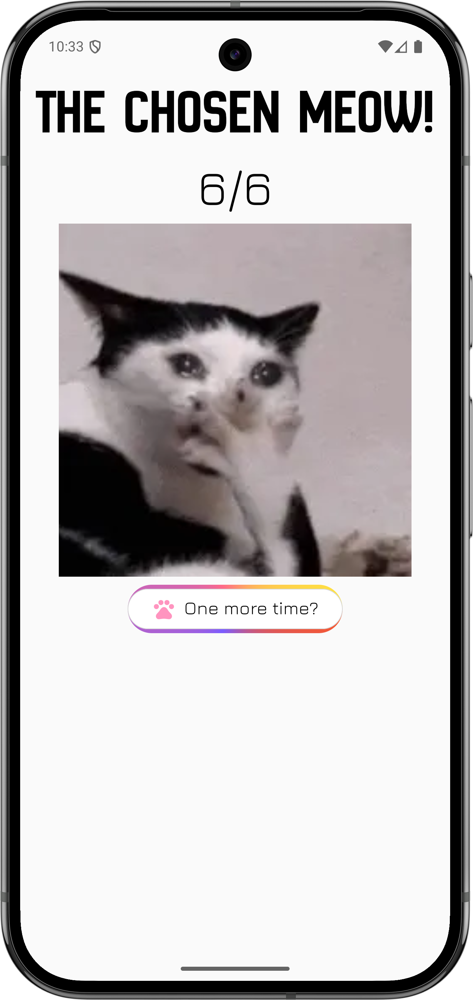

# 🐾 Quiz App

## ✨Features

### 🐱 Multiple Quiz Themes

Users can choose between different quiz themes:

* Cats Quiz
* Dogs Quiz

Each theme contains its own set of meme-based questions and result outcomes.

### 🎮 Interactive Quiz Gameplay

For each question the user sees:

* Meme image
* Question text
* Two answer buttons: Yes / No

Correct answers trigger a confetti animation for positive feedback.

### 🏆 Leaderboard

After finishing the quiz:

* Users see their score
* They can enter their name
* The score is saved to the leaderboard
* Leaderboard features:
* Global score storage
* Sorting by score percentage
* Reactive updates via Firestore Flow

### 🎉 Animated Feedback

Correct answers trigger a Lottie confetti animation that plays before the next question appears, making the experience more engaging.

### 🏗 Architecture

The app follows a reactive MVVM architecture with clear separation between UI, business logic, and data.

Layers:

* UI (Jetpack Compose) — displays state and sends user events
* ViewModel — processes events and manages screen state
* Storage layer — handles leaderboard data using Firebase Firestore
* State is managed using the Revolver state machine, where the UI sends events to the ViewModel and receives immutable states in response.
* UI → ViewEvent → ViewModel → ViewState → UI

Scores are stored and observed via Firebase Firestore using Kotlin Flow, which allows the leaderboard to update reactively.

## 📸 Screenshots

    


## 🚀 Getting Started

To run the application, please download the latest release from the Releases section.

or

Either pass github credentials as environment variables or set them in this code block:

```kotlin
dependencyResolutionManagement {
    repositories {
        maven {
            url = uri("https://maven.pkg.github.com/apegroup/revolver/")

            credentials {
                username = System.getenv("GH_USERNAME") ?: ""
                password = System.getenv("GH_TOKEN") ?: ""
            }
        }
    }
}
```
